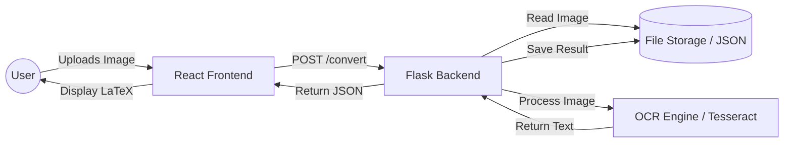
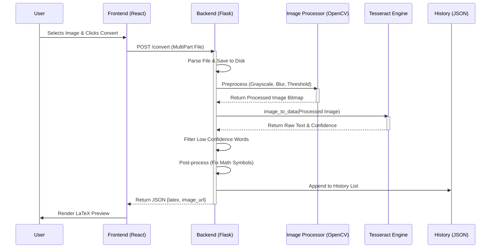

# NOTEX - HANDWRITTEN NOTES TO LATEX CONVERTER

## 1. INTRODUCTION

### 1.1. PROJECT DESCRIPTION
**Notex** is a web-based application designed to bridge the gap between handwritten mathematical notes and digital scientific documentation. In the academic and scientific communities, LaTeX is the gold standard for typesetting mathematical formulas and documents. However, converting handwritten equations into LaTeX code is a tedious, manual process that consumes significant time and effort. 

Notex leverages Computer Vision (OpenCV) and Optical Character Recognition (OCR) technologies to automate this process. Users can simply upload images of their handwritten notes, and the system processes them to identify mathematical symbols and text, converting them into valid LaTeX code. The application provides a seamless user experience with features like batch processing, real-time preview, history management, and the ability to export results as `.tex` or `.pdf` files. This project aims to enhance productivity for students, researchers, and educators by digitizing handwritten content efficiently.

---

## 2. LITERATURE SURVEY

### 2.1. DOMAIN SURVEY
The domain of **Optical Character Recognition (OCR)** for mathematical expressions is a specialized niche within the broader field of Document Analysis and Recognition (DAR). Unlike standard text OCR, mathematical notation involves complex spatial relationships (superscripts, subscripts, fractions, matrices) that cannot be parsed linearly.

Key technologies in this domain include:
- **Tesseract OCR**: An open-source OCR engine maintained by Google, widely used for text recognition. While powerful for standard text, it requires pre-processing and specific configuration to handle mathematical structures effectively.
- **OpenCV (Open Source Computer Vision Library)**: Essential for image pre-processing tasks such as binarization, noise reduction, and segmentation, which are critical for improving OCR accuracy on handwritten inputs.
- **Machine Learning/Deep Learning**: Modern approaches often use Encoder-Decoder architectures (like CNN-RNN models) to translate image features directly into LaTeX sequences, though traditional OCR with heuristic post-processing remains a viable lightweight alternative for specific constraints.

### 2.2. RELATED WORK
Several studies and projects have attempted to solve the "Image to LaTeX" problem:
- **Im2Latex**: A dataset and benchmark for converting images of formulas to LaTeX, which fostered development of deep learning models like "Show, Attend and Tell".
- **MathPix**: A commercial tool that set the industry standard for accuracy using proprietary deep learning models.
- **InftyReader**: One of the earliest OCR systems dedicated to scientific documents, focusing on printed math.

### 2.3. EXISTING SYSTEMS
- **MathPix Snip**: High accuracy, multi-platform, but closed-source and subscription-based.
- **Simple OCR Tools**: Generic online OCR tools often fail completely with mathematical structures, outputting gibberish instead of formatted equations.
- **Manual Transcription**: The default "system" for most users, which is slow and error-prone.

**Notex** positions itself as an accessible, self-hosted, or lightweight alternative that integrates batch processing and history management, tailored for personal or academic use cases without heavy proprietary dependencies.

---

## 3. HARDWARE AND SOFTWARE REQUIREMENTS

### 3.1. HARDWARE REQUIREMENTS
To ensure smooth operation of the Notex application (especially the OCR and image processing components), the following hardware specifications are recommended:

- **Processor**: Dual-Core CPU (Intel Core i3 or equivalent AMD) or better. Image processing can be CPU-intensive.
- **RAM**: Minimum 4GB (8GB recommended) to handle image buffers and the browser/backend concurrency.
- **Storage**: At least 1GB of free space for application files, dependencies, and temporary image storage.
- **Input Device**: Scanner or High-resolution Camera (smartphone) to capture clear images of handwriting.

### 3.2. SOFTWARE REQUIREMENTS
The project is built using a modern web stack and necessitates the following software environment:

**Client Side:**
- **Web Browser**: Modern browser (Chrome, Firefox, Edge, Safari) with JavaScript enabled.
- **React**: Frontend library for building the user interface.
- **Vite**: Build tool for fast development.

**Server Side:**
- **Operating System**: Windows / Linux / macOS.
- **Python 3.8+**: Runtime environment for the backend logic.
- **Flask**: Lightweight WSGI web application framework.
- **Tesseract-OCR**: The OCR engine binary must be installed on the host system.

**Libraries & Dependencies:**
- `opencv-python` (Image processing)
- `pytesseract` (OCR wrapper)
- `numpy`, `pillow` (Image manipulation)
- `reportlab` (PDF generation)
- `flask-cors` (CORS handling)

---

## 4. SOFTWARE REQUIREMENTS SPECIFICATION

### 4.1. USERS
The system is designed for the following user groups:
- **Students**: To convert lecture notes and homework into clean, digital assignments.
- **Researchers/Academics**: To quickly digitize rough drafts of papers or derivations.
- **Teachers**: To convert handwritten solutions or notes into handouts for students.
- **Demo User**: A strictly defined role for testing functionalities (e.g., `email: demo@notex.local`).

### 4.2. FUNCTIONAL REQUIREMENTS
1.  **User Authentication**:
    - Users must be able to log in to access the system (currently simplified with demo credentials).
    - Secure token-based session management.

2.  **Image Upload & Processing**:
    - **Single File Upload**: Upload a single image for conversion.
    - **Batch Processing**: Drag-and-drop multiple images to process them in a queue.
    - **File Validation**: System must reject non-image files or corrupted inputs.

3.  **Image Pre-processing**:
    - Automatic conversion to grayscale.
    - Gaussian blurring for noise reduction.
    - OTSU Thresholding for optimal binarization (separating text from background).

4.  **OCR & Conversion**:
    - Extract text and mathematical symbols from images using Tesseract.
    - Post-process raw text to correct common OCR errors (e.g., `x2` -> `x^2`, `pi` -> `\pi`).
    - Format output as a valid LaTeX `aligned` block.

5.  **History Management**:
    - Automatically save conversion results.
    - Retrieve processing history containing original image, LaTeX code, and timestamp.
    - "Last 50 entries" retention policy to manage storage.

6.  **Export & Output**:
    - View rendered LaTeX equations using KaTeX.
    - Export results as `.tex` source files.
    - Export results as rendered `.pdf` documents.

### 4.3. NON-FUNCTIONAL REQUIREMENTS
- **Performance**: Image processing should complete within seconds for standard A4 sized images.
- **Reliability**: The system should handle OCR failures gracefully (e.g., "Text could not be reliably detected") without crashing.
- **Usability**: The UI should be intuitive, with clear feedback (loading states, toast notifications) and a modern aesthetic (Dark/Glassmorphism).
- **Scalability**: The backend structure (Flask) allows for future expansion (e.g., adding database, user accounts).

---

## 5. SYSTEM DESIGN

### 5.1. ARCHITECTURE
Notex follows a classic **Client-Server Architecture** (or 3-Tier Architecture if considering the file storage as a data layer).

1.  **Presentation Layer (Frontend)**:
    - Built with **React** and **Vite**.
    - Handles user interactions, file selection, drag-and-drop, and LaTeX rendering (via `react-katex`).
    - Communicates with the backend via RESTful API calls using `Axios`.

2.  **Logic Layer (Backend)**:
    - Built with **Flask** (Python).
    - Exposes API endpoints (`/convert`, `/history`, `/auth`).
    - Orchestrates the business logic: receiving files, invoking OpenCV for image cleanup, calling Tesseract for OCR, and formatting the output.

3.  **Data Persistence**:
    - **File System**: Stores uploaded images in an `uploads/` directory.
    - **JSON Store**: Maintains conversion history in `history.json` (a lightweight NoSQL-style approach for this specific scope).

### 5.2. CONTEXT FLOW DIAGRAM
The following high-level diagram illustrates the data flow between the user and the system components.



---

## 6. DETAILED DESIGN

### 6.1. USE CASE DIAGRAM
This diagram represents the actors and their interactions with the system's use cases.

```mermaid
usecaseDiagram
    actor User as "Student / Researcher"
    actor System as "System Backend"

    package Notex_Application {
        usecase "Upload Image(s)" as UC1
        usecase "Convert to Latex" as UC2
        usecase "View Preview" as UC3
        usecase "Export PDF/TeX" as UC4
        usecase "View History" as UC5
        usecase "Login" as UC6
    }

    User --> UC6
    User --> UC1
    UC1 --> UC2 : Triggers
    UC2 --> System : Uses OCR
    System --> UC3 : Returns Result
    User --> UC3
    User --> UC4
    User --> UC5
```

### 6.2. SEQUENCE DIAGRAM
A sequence diagram detailing the successful conversion flow of a single image.



---

## 7. IMPLEMENTATION

### 7.1. PSEUDOCODE
The core logic resides in the image processing and OCR pipeline. Below is the simplified pseudocode for the conversion algorithm.

```text
FUNCTION ProcessImage(image_file):
    // 1. Save and Load
    filename = GenerateUniqueName(image_file.name)
    SaveFile(image_file, connection_path + filename)
    img = ReadImage(path + filename)

    // 2. Pre-processing
    if img is Invalid:
        RETURN Error("Invalid Image")
    
    gray_img = ConvertToGrayscale(img)
    blurred_img = GaussianBlur(gray_img, kernel_size=(3,3))
    binary_img = OtsuThreshold(blurred_img) // Automatic thresholding

    // 3. OCR Extraction
    config = "--language eng --oem 3 --psm 11" // PSM 11 = Sparse text
    ocr_data = Tesseract.ImageToData(binary_img, config)

    // 4. Filtering and Confidence Check
    extracted_words = []
    FOR each word IN ocr_data:
        IF word.confidence > 60 AND length(word) > 1:
             extracted_words.APPEND(word.text)

    IF extracted_words IS EMPTY:
        extracted_words.APPEND("Text could not be reliably detected")

    // 5. Post-processing (Symbol Fixes)
    processed_text = []
    FOR word IN extracted_words:
        word = Replace(word, "pi", "\pi")
        word = Replace(word, "x2", "x^2")
        word = Replace(word, "sqrt", "\sqrt{}")
        // ... more replacements
        processed_text.APPEND(word)

    // 6. Formatting
    latex_body = Join(processed_text, " ")
    final_latex = "\begin{aligned}\n" + latex_body + "\n\end{aligned}"

    // 7. Save and Return
    SaveToHistory(filename, final_latex)
    RETURN { 
        status: "success", 
        latex: final_latex, 
        image: filename 
    }
END FUNCTION
```

### 7.2. OUTPUT
The system provides outputs in multiple formats:

1.  **Visual Output (Frontend)**:
    - A specific result card is displayed showing:
        - **Status Icon**: Green checkmark for success, red cross for failure.
        - **Original Image**: Thumbnail of the uploaded note.
        - **Rendered LaTeX**: The mathematical equation rendered beautifully using KaTeX.
    
2.  **JSON Response (API)**:
    ```json
    {
      "filename": "notes_01.jpg",
      "status": "success",
      "latex": "\\begin{aligned}\n E = mc^2 \n\\end{aligned}",
      "image_filename": "notes_01_170322.jpg"
    }
    ```

3.  **File Exports**:
    - **.tex File**: A downloadable text file containing the raw LaTeX code, ready to be included in scientific papers.
    - **.pdf File**: A compiled PDF document showing the rendered equation on an A4 page.
